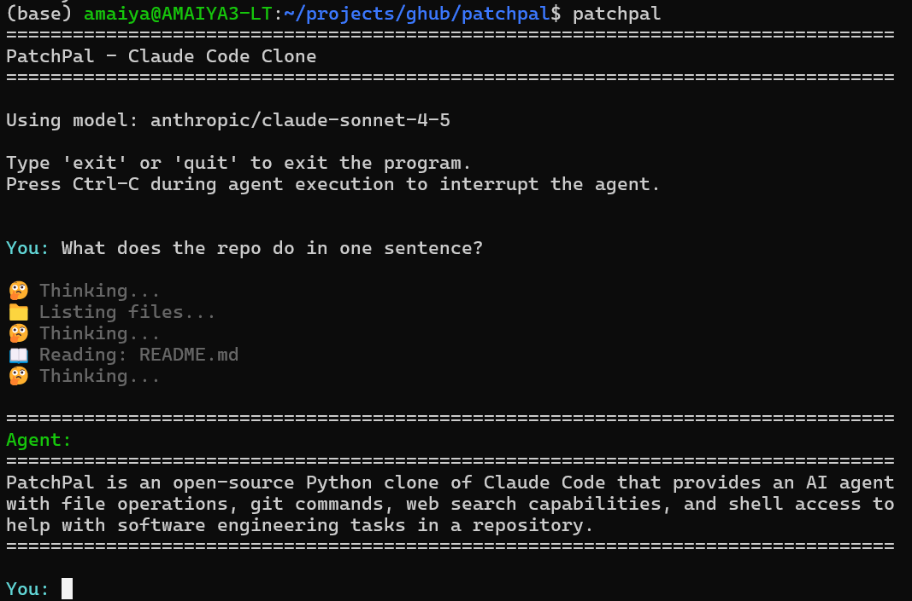

# PatchPal — A Claude Code–Style Agent in Python

<!---->


> A lightweight Claude Code–inspired coding and automation assistant -- supports both local and cloud LLMs.

**PatchPal** is an AI coding agent that helps you build software, debug issues, and automate tasks.  Like Claude Code, it supports agent skills, tool use, and executable Python generation, enabling interactive workflows for tasks such as data analysis, visualization, web scraping, API interactions, and research with synthesized findings.

A key goal of this project is to approximate Claude Code's core functionality while remaining lean, accessible, and configurable, enabling learning, experimentation, and broad applicability across use cases.

```bash
$ls ./patchpal
__init__.py agent.py  cli.py context.py permissions.py  skills.py system_prompt.md tool_schema.py tools.py
```

## Quick Start

```bash
$ pip install patchpal  # install
$ patchpal              # start
```

## Table of Contents

- [Installation](https://github.com/amaiya/patchpal?tab=readme-ov-file#installation)
- [Setup](https://github.com/amaiya/patchpal?tab=readme-ov-file#setup)
- [Features](https://github.com/amaiya/patchpal?tab=readme-ov-file#features)
  - [Tools](https://github.com/amaiya/patchpal?tab=readme-ov-file#tools)
    - [File Operations](https://github.com/amaiya/patchpal?tab=readme-ov-file#file-operations)
    - [Task Planning (TODO System)](https://github.com/amaiya/patchpal?tab=readme-ov-file#task-planning-todo-system)
    - [User Interaction](https://github.com/amaiya/patchpal?tab=readme-ov-file#user-interaction)
    - [Git Operations](https://github.com/amaiya/patchpal?tab=readme-ov-file#git-operations-no-permission-required)
    - [Web Capabilities](https://github.com/amaiya/patchpal?tab=readme-ov-file#web-capabilities-requires-permission)
  - [Skills System](https://github.com/amaiya/patchpal?tab=readme-ov-file#skills-system)
- [Model Configuration](https://github.com/amaiya/patchpal?tab=readme-ov-file#model-configuration)
  - [Supported Models](https://github.com/amaiya/patchpal?tab=readme-ov-file#supported-models)
  - [Using Local Models (vLLM & Ollama)](https://github.com/amaiya/patchpal?tab=readme-ov-file#using-local-models-vllm--ollama)
  - [Air-Gapped and Offline Environments](https://github.com/amaiya/patchpal?tab=readme-ov-file#air-gapped-and-offline-environments)
  - [Maximum Security Mode](https://github.com/amaiya/patchpal?tab=readme-ov-file#maximum-security-mode)
- [Usage](https://github.com/amaiya/patchpal?tab=readme-ov-file#usage)
- [Python API](https://github.com/amaiya/patchpal?tab=readme-ov-file#python-api)
- [Configuration](https://github.com/amaiya/patchpal?tab=readme-ov-file#configuration)
- [Example Tasks](https://github.com/amaiya/patchpal?tab=readme-ov-file#example-tasks)
- [Safety](https://github.com/amaiya/patchpal?tab=readme-ov-file#safety)
- [Context Management](https://github.com/amaiya/patchpal?tab=readme-ov-file#context-management)
- [Troubleshooting](https://github.com/amaiya/patchpal?tab=readme-ov-file#troubleshooting)


## Installation

Install PatchPal from PyPI:

```bash
pip install patchpal
```

**Supported Operating Systems:**  Linux, MacOS, MS Windows.


## Setup


1. **Get an API key or a Local LLM Engine**:
   - **[Cloud]** For Anthropic models (default): Sign up at https://console.anthropic.com/
   - **[Cloud]** For OpenAI models: Get a key from https://platform.openai.com/
   - **[Local]** For vLLM: Install from https://docs.vllm.ai/ (free - no API charges) **Recommended for Local Use**
   - **[Local]** For Ollama: Install from https://ollama.com/ (⚠️ requires `OLLAMA_CONTEXT_LENGTH=32768` - see Ollama section below)
   - For other providers: Check the [LiteLLM documentation](https://docs.litellm.ai/docs/providers)

2. **Set up your API key as environment variable**:
```bash

# For Anthropic (default)
export ANTHROPIC_API_KEY=your_api_key_here

# For OpenAI
export OPENAI_API_KEY=your_api_key_here

# For vLLM - API key required only if configured
export HOSTED_VLLM_API_BASE=http://localhost:8000 # depends on your vLLM setup
export HOSTED_VLLM_API_KEY=token-abc123           # optional depending on your vLLM setup

# For other providers, check LiteLLM docs
```

3. **Run PatchPal**:
```bash
# Use default model (anthropic/claude-sonnet-4-5)
patchpal

# Use a specific model via command-line argument
patchpal --model openai/gpt-4o  # or openai/gpt-5, anthropic/claude-opus-4-5 etc.

# Use vLLM (local)
# Note: vLLM server must be started with --tool-call-parser and --enable-auto-tool-choice
# See "Using Local Models (vLLM & Ollama)" section below for details
export HOSTED_VLLM_API_BASE=http://localhost:8000
export HOSTED_VLLM_API_KEY=token-abc123
patchpal --model hosted_vllm/openai/gpt-oss-20b

# Use Ollama (local - requires OLLAMA_CONTEXT_LENGTH=32768)
export OLLAMA_CONTEXT_LENGTH=32768
patchpal --model ollama_chat/qwen3:32b

# Or set the model via environment variable
export PATCHPAL_MODEL=openai/gpt-5
patchpal
```

## Features

### Tools

The agent has the following tools:

### File Operations
- **read_file**: Read contents of files in the repository
- **read_lines**: Read specific line ranges from a file without loading the entire file
  - Example: `read_lines("app.py", 100, 150)` - read lines 100-150
  - More efficient than read_file when you only need a few lines
  - Useful for viewing code sections, error context, or specific regions of large files
- **list_files**: List all files in the repository
- **get_file_info**: Get detailed metadata for file(s) - size, modification time, type
  - Supports single files: `get_file_info("file.txt")`
  - Supports directories: `get_file_info("src/")`
  - Supports glob patterns: `get_file_info("tests/*.py")`
- **find_files**: Find files by name pattern using glob-style wildcards
  - Example: `find_files("*.py")` - all Python files
  - Example: `find_files("test_*.py")` - all test files
  - Example: `find_files("**/*.md")` - all markdown files recursively
  - Supports case-insensitive matching
- **tree**: Show directory tree structure to understand folder organization
  - Example: `tree(".")` - show tree from current directory
  - Configurable max depth (default: 3, max: 10)
  - Option to show/hide hidden files
- **grep_code**: Search for patterns in code files (regex support, file filtering)
- **edit_file**: Edit a file by replacing an exact string (efficient for small changes)
  - Example: `edit_file("config.py", "port = 3000", "port = 8080")`
  - More efficient than apply_patch for targeted changes
  - Old string must appear exactly once in the file
- **apply_patch**: Modify files by providing complete new content
- **run_shell**: Execute shell commands (requires user permission; privilege escalation blocked)

### Task Planning (TODO System)
- **todo_add**: Add a new task to break down complex work into manageable subtasks
  - Example: `todo_add("Implement authentication", details="Use JWT tokens")`
  - Each task gets a unique ID for tracking
- **todo_list**: Show all tasks with their status and progress
  - Example: `todo_list()` - show pending tasks only
  - Example: `todo_list(show_completed=True)` - show all tasks including completed
- **todo_complete**: Mark a task as done
  - Example: `todo_complete(1)` - mark task #1 as completed
- **todo_update**: Update task description or details
  - Example: `todo_update(1, description="Implement OAuth2 authentication")`
- **todo_remove**: Remove a task from the list
  - Example: `todo_remove(1)` - remove task #1
- **todo_clear**: Clear completed tasks or start fresh
  - Example: `todo_clear()` - clear completed tasks only
  - Example: `todo_clear(completed_only=False)` - clear all tasks

### User Interaction
- **ask_user**: Ask the user a question during task execution
  - Example: `ask_user("Which database should I use?", options=["PostgreSQL", "MySQL", "SQLite"])`
  - Useful for clarifying requirements, getting decisions, or gathering additional information
  - Supports multiple choice options or free-form answers

### Git Operations (No Permission Required)
- **git_status**: Show modified, staged, and untracked files
- **git_diff**: Show changes in working directory or staged area
  - Optional parameters: `path` (specific file), `staged` (show staged changes)
- **git_log**: Show commit history
  - Optional parameters: `max_count` (number of commits, max 50), `path` (specific file history)

### Web Capabilities (Requires Permission)
- **web_search**: Search the web using DuckDuckGo (no API key required!)
  - Look up error messages and solutions
  - Find current documentation and best practices
  - Research library versions and compatibility
  - Requires permission to prevent information leakage about your codebase
- **web_fetch**: Fetch and read content from URLs
  - Read documentation pages
  - Access API references
  - Extract readable text from HTML pages
  - Requires permission to prevent information leakage about your codebase

### Skills System

Skills are reusable workflows and custom commands that can be invoked by name or discovered automatically by the agent.

**Creating Your Own Skills:**

1. **Choose a location:**
   - Personal skills (all projects): `~/.patchpal/skills/<skill-name>/SKILL.md`
   - Project-specific skills: `<repo>/.patchpal/skills/<skill-name>/SKILL.md`

2. **Create the skill file:**
```bash
# Create a personal skill
mkdir -p ~/.patchpal/skills/my-skill
cat > ~/.patchpal/skills/my-skill/SKILL.md <<'EOF'
---
name: my-skill
description: Brief description of what this skill does
---
# Instructions
Your detailed instructions here...
EOF
```

3. **Skill File Format:**
```markdown
---
name: skill-name
description: One-line description
---
# Detailed Instructions
- Step 1: Do this
- Step 2: Do that
- Use specific PatchPal tools like git_status, read_file, etc.
```

**Example Skills:**

The PatchPal repository includes [example skills](https://github.com/amaiya/patchpal/tree/main/examples) you can use as templates:
- **commit**: Best practices for creating git commits
- **review**: Comprehensive code review checklist
- **add-tests**: Add comprehensive pytest tests (includes code block templates)
- **slack-gif-creator**: Create animated GIFs for Slack (from [Anthropic's official skills repo](https://github.com/anthropics/skills), demonstrates Claude Code compatibility)
- **skill-creator**: Guide for creating effective skills with bundled scripts and references (from [Anthropic's official skills repo](https://github.com/anthropics/skills/tree/main/skills/skill-creator), demonstrates full bundled resources support)

**After `pip install patchpal`, get examples:**

```bash
# Quick way: Download examples directly from GitHub
curl -L https://github.com/amaiya/patchpal/archive/main.tar.gz | tar xz --strip=1 patchpal-main/examples

# Or clone the repository
git clone https://github.com/amaiya/patchpal.git
cd patchpal

# Copy examples to your personal skills directory
cp -r examples/skills/commit ~/.patchpal/skills/
cp -r examples/skills/review ~/.patchpal/skills/
cp -r examples/skills/add-tests ~/.patchpal/skills/
```

**View examples online:**
Browse the [examples/skills/](https://github.com/amaiya/patchpal/tree/main/examples/skills) directory on GitHub to see the skill format and create your own.

You can also try out the example skills at [anthropic/skills](https://github.com/anthropics/skills).


**Using Skills:**

There are two ways to invoke skills:

1. **Direct invocation** - Type `/skillname` at the prompt:
```bash
$ patchpal
You: /commit Fix authentication bug
```

2. **Natural language** - Just ask, and the agent discovers the right skill:
```bash
You: Help me commit these changes following best practices
# Agent automatically discovers and uses the commit skill
```

**Finding Available Skills:**

Ask the agent to list them:
```bash
You: list skills
```

**Skill Priority:**

Project skills (`.patchpal/skills/`) override personal skills (`~/.patchpal/skills/`) with the same name.

## Model Configuration

PatchPal supports any LiteLLM-compatible model. You can configure the model in three ways (in order of priority):

### 1. Command-line Argument
```bash
patchpal --model openai/gpt-5
patchpal --model anthropic/claude-sonnet-4-5
patchpal --model hosted_vllm/openai/gpt-oss-20b # local model - no API charges
```

### 2. Environment Variable
```bash
export PATCHPAL_MODEL=openai/gpt-5
patchpal
```

### 3. Default Model
If no model is specified, PatchPal uses `anthropic/claude-sonnet-4-5` (Claude Sonnet 4.5).

### Supported Models

PatchPal works with any model supported by LiteLLM, including:

- **Anthropic** (Recommended): `anthropic/claude-sonnet-4-5`, `anthropic/claude-opus-4-5`, `anthropic/claude-3-7-sonnet-latest`
- **OpenAI**: `openai/gpt-5`, `openai/gpt-4o`
- **AWS Bedrock**: `bedrock/anthropic.claude-sonnet-4-5-v1:0`
- **vLLM (Local)** (Recommended for local): See vLLM section below for setup
- **Ollama (Local)**:  See Ollama section below for setup
- **Google**: `gemini/gemini-pro`, `vertex_ai/gemini-pro`
- **Others**: Cohere, Azure OpenAI, and many more


See the [LiteLLM providers documentation](https://docs.litellm.ai/docs/providers) for the complete list.

<!--### Using AWS Bedrock (Including GovCloud and VPC Endpoints)-->

<!--PatchPal supports AWS Bedrock with custom regions and VPC endpoints for secure enterprise deployments.-->

<!--**Basic AWS Bedrock Setup:**-->
<!--```bash-->
<!--# Set AWS credentials-->
<!--export AWS_ACCESS_KEY_ID=your_access_key-->
<!--export AWS_SECRET_ACCESS_KEY=your_secret_key-->

<!--# Use Bedrock model-->
<!--patchpal --model bedrock/anthropic.claude-sonnet-4-5-20250929-v1:0-->
<!--```-->

<!--**AWS GovCloud or VPC Endpoint Setup:**-->
<!--```bash-->
<!--# Set AWS credentials-->
<!--export AWS_ACCESS_KEY_ID=your_access_key-->
<!--export AWS_SECRET_ACCESS_KEY=your_secret_key-->

<!--# Set custom region (e.g., GovCloud)-->
<!--export AWS_BEDROCK_REGION=us-gov-east-1-->

<!--# Set VPC endpoint URL (optional, for VPC endpoints)-->
<!--export AWS_BEDROCK_ENDPOINT=https://vpce-xxxxx.bedrock-runtime.us-gov-east-1.vpce.amazonaws.com-->

<!--# Use Bedrock with full ARN (bedrock/ prefix is optional - auto-detected)-->
<!--patchpal --model "arn:aws-us-gov:bedrock:us-gov-east-1:012345678901:inference-profile/us-gov.anthropic.claude-sonnet-4-5-20250929-v1:0"-->
<!--```-->

<!--**Environment Variables for Bedrock:**-->
<!--- `AWS_ACCESS_KEY_ID`: AWS access key ID (required)-->
<!--- `AWS_SECRET_ACCESS_KEY`: AWS secret access key (required)-->
<!--- `AWS_BEDROCK_REGION`: Custom AWS region (e.g., `us-gov-east-1` for GovCloud)-->
<!--- `AWS_BEDROCK_ENDPOINT`: Custom endpoint URL for VPC endpoints or GovCloud-->

### Using Local Models (vLLM & Ollama)

Run models locally on your machine without needing API keys or internet access.

**⚠️ IMPORTANT: For local models, we recommend vLLM.**

vLLM provides:
- ✅ Robust multi-turn tool calling
- ✅ 3-10x faster inference than Ollama
- ✅ Production-ready reliability

#### vLLM (Recommended for Local Models)

vLLM is significantly faster than Ollama due to optimized inference with continuous batching and PagedAttention.

**Important:** vLLM >= 0.10.2 is required for proper tool calling support.

**Using Local vLLM Server:**

```bash
# 1. Install vLLM (>= 0.10.2)
pip install vllm

# 2. Start vLLM server with tool calling enabled
vllm serve openai/gpt-oss-20b \
  --dtype auto \
  --api-key token-abc123 \
  --tool-call-parser openai \
  --enable-auto-tool-choice

# 3. Use with PatchPal (in another terminal)
export HOSTED_VLLM_API_BASE=http://localhost:8000
export HOSTED_VLLM_API_KEY=token-abc123
patchpal --model hosted_vllm/openai/gpt-oss-20b
```

**Using Remote/Hosted vLLM Server:**

```bash
# For remote vLLM servers (e.g., hosted by your organization)
export HOSTED_VLLM_API_BASE=https://your-vllm-server.com
export HOSTED_VLLM_API_KEY=your_api_key_here
patchpal --model hosted_vllm/openai/gpt-oss-20b
```

**Environment Variables:**
- Use `HOSTED_VLLM_API_BASE` and `HOSTED_VLLM_API_KEY`

**Using YAML Configuration (Alternative):**

Create a `config.yaml`:
```yaml
host: "0.0.0.0"
port: 8000
api-key: "token-abc123"
tool-call-parser: "openai"  # Use appropriate parser for your model
enable-auto-tool-choice: true
dtype: "auto"
```

Then start vLLM:
```bash
vllm serve openai/gpt-oss-20b --config config.yaml

# Use with PatchPal
export HOSTED_VLLM_API_BASE=http://localhost:8000
export HOSTED_VLLM_API_KEY=token-abc123
patchpal --model hosted_vllm/openai/gpt-oss-20b
```

**Recommended models for vLLM:**
- `openai/gpt-oss-20b` - OpenAI's open-source model (use parser: `openai`)

**Tool Call Parser Reference:**
Different models require different parsers. Common parsers include: `qwen3_xml`, `openai`, `deepseek_v3`, `llama3_json`, `mistral`, `hermes`, `pythonic`, `xlam`. See [vLLM Tool Calling docs](https://docs.vllm.ai/en/latest/features/tool_calling/) for the complete list.

#### Ollama

Ollama v0.14+ supports tool calling for agentic workflows. However, proper configuration is **critical** for reliable operation.

**Requirements:**

1. **Ollama v0.14.0 or later** - Required for tool calling support
2. **Sufficient context window** - Default 4096 tokens is too small; increase to at least 32K

**Setup Instructions:**

**For Native Ollama Installation:**

```bash
# Set context window size (required!)
export OLLAMA_CONTEXT_LENGTH=32768

# Start Ollama server
ollama serve

# In another terminal, use with PatchPal
patchpal --model ollama_chat/gpt-oss:20b
```

**For Docker:**

```bash
# Stop existing container (if running)
docker stop ollama
docker rm ollama

# Start with proper configuration
docker run -d \
  --gpus all \
  -e OLLAMA_CONTEXT_LENGTH=32768 \
  -v ollama:/root/.ollama \
  -p 11434:11434 \
  --name ollama \
  ollama/ollama

# Verify configuration
docker exec -it ollama ollama run gpt-oss:20b
# In the Ollama prompt, type: /show parameters
# Should show num_ctx much larger than default 4096

# Use with PatchPal
patchpal --model ollama_chat/gpt-oss:20b
```

**Verifying Context Window Size:**

```bash
# Check your Ollama container configuration
docker inspect ollama | grep OLLAMA_CONTEXT_LENGTH

# Or run a model and check parameters
docker exec -it ollama ollama run gpt-oss:20b
>>> /show parameters
```

**Recommended Models for Tool Calling:**

- `gpt-oss:20b` - OpenAI's open-source model, excellent tool calling
- `qwen3:32b` - Qwen3 model with good agentic capabilities
- `qwen3-coder` - Specialized for coding tasks

**Performance Note:**

While Ollama now works with proper configuration, vLLM is still recommended for production use due to:
- 3-10x faster inference
- More robust tool calling implementation
- Better memory management

**Examples:**

```bash
# Ollama (works with proper configuration)
export OLLAMA_CONTEXT_LENGTH=32768
patchpal --model ollama_chat/qwen3:32b
patchpal --model ollama_chat/gpt-oss:20b

# vLLM (recommended for production)
patchpal --model hosted_vllm/openai/gpt-oss-20b
```

### Air-Gapped and Offline Environments

For environments without internet access (air-gapped, offline, or restricted networks), you can disable web search and fetch tools:

```bash
# Disable web tools for air-gapped environment
export PATCHPAL_ENABLE_WEB=false
patchpal

# Or combine with local vLLM for complete offline operation (recommended)
export PATCHPAL_ENABLE_WEB=false
export HOSTED_VLLM_API_BASE=http://localhost:8000
export HOSTED_VLLM_API_KEY=token-abc123
patchpal --model hosted_vllm/openai/gpt-oss-20b
```

When web tools are disabled:
- `web_search` and `web_fetch` are removed from available tools
- With a local model, the agent won't attempt any network requests
- Perfect for secure, isolated, or offline development environments

### Viewing Help
```bash
patchpal --help
```

### Maximum Security Mode

For maximum security and control, you can require permission for **all** operations including read operations:

```bash
patchpal --require-permission-for-all
```

When enabled, the agent will prompt for permission before:
- **Read operations**: `read_file`, `list_files`, `get_file_info`, `find_files`, `tree`, `grep_code`, `git_status`, `git_diff`, `git_log`
- **Write operations**: `edit_file`, `apply_patch` (always require permission)
- **Shell commands**: `run_shell` (always requires permission)
- **Web operations**: `web_search`, `web_fetch` (always require permission)

**Granular session permissions:**
When you grant permission for read operations, you can choose to grant it for:
- **This specific operation only** (option 1)
- **This specific file/pattern for the session** (option 2) - e.g., grant permission to read `config.py` for the session, but still prompt for other files
- **Cancel the operation** (option 3)

This provides fine-grained control over what the agent can access during the session.

**Use cases:**
- Working with highly sensitive codebases
- Security audits where every operation must be reviewed
- Training/demonstration purposes where you want to see exactly what the agent does
- Untrusted environments where you want complete control

**Example session:**
```bash
$ patchpal --require-permission-for-all
================================================================================
PatchPal - Claude Code–inspired coding and automation assistant
================================================================================

Using model: anthropic/claude-sonnet-4-5
🔒 Permission required for ALL operations (including reads)

You: Read config.py and database.py

================================================================================
Read File
--------------------------------------------------------------------------------
   Read: config.py
--------------------------------------------------------------------------------

Do you want to proceed?
  1. Yes
  2. Yes, and don't ask again this session for 'config.py'
  3. No, and tell me what to do differently

Choice [1-3]: 2

# Agent reads config.py, then prompts for database.py

================================================================================
Read File
--------------------------------------------------------------------------------
   Read: database.py
--------------------------------------------------------------------------------

Do you want to proceed?
  1. Yes
  2. Yes, and don't ask again this session for 'database.py'
  3. No, and tell me what to do differently

Choice [1-3]: 1

# Agent reads database.py, but will prompt again if it tries to read it later
# Won't prompt again for config.py since you chose option 2
```

**Note:** This mode is separate from and overrides `PATCHPAL_REQUIRE_PERMISSION=false`. Even if you've disabled the standard permission system, `--require-permission-for-all` will still prompt for all operations.

## Usage

Simply run the `patchpal` command and type your requests interactively:

```bash
$ patchpal
================================================================================
PatchPal - Claude Code Clone
================================================================================

Using model: anthropic/claude-sonnet-4-5

Type 'exit' to quit.
Use '/status' to check context window usage, '/compact' to manually compact.
Use 'list skills' or /skillname to invoke skills.
Press Ctrl-C during agent execution to interrupt the agent.

You: Add type hints and basic logging to my_module.py
```

The agent will process your request and show you the results. You can continue with follow-up tasks or type `exit` to quit.

**Interactive Features:**
- **Path Autocompletion**: Press `Tab` while typing file paths to see suggestions (e.g., `./src/mo` + Tab → `./src/models.py`)
- **Skill Autocompletion**: Type `/` followed by Tab to see available skills (e.g., `/comm` + Tab → `/commit`)
- **Command History**: Use ↑ (up arrow) and ↓ (down arrow) to navigate through previous commands within the current session
- **Interrupt Agent**: Press `Ctrl-C` during agent execution to stop the current task without exiting PatchPal
- **Exit**: Type `exit`, `quit`, or press `Ctrl-C` at the prompt to exit PatchPal

## Python API

PatchPal can be used programmatically from Python scripts or a REPL, giving you full agent capabilities with a simple API. **Unlike fully autonomous agent frameworks, PatchPal is designed for human-in-the-loop workflows** where users maintain control through interactive permission prompts, making it ideal for code assistance, debugging, and automation tasks that benefit from human oversight.

**Basic Usage:**

```python
from patchpal.agent import create_agent

# Create an agent (uses default model or PATCHPAL_MODEL env var)
agent = create_agent()

# Or specify a model explicitly
agent = create_agent(model_id="anthropic/claude-sonnet-4_5")

# Run the agent on a task
response = agent.run("List all Python files in this directory")
print(response)

# Continue the conversation (history is maintained)
response = agent.run("Now read the main agent file")
print(response)
```

**Adding Custom Tools:**

One advantage of the Python API, is that it can easily be used with custom tools that you define as Python functions. Tool schemas are auto-generated from Python functions with type hints and docstrings:

```python
from patchpal.agent import create_agent

def calculator(x: int, y: int, operation: str = "add") -> str:
    """Perform basic arithmetic operations.

    Args:
        x: First number
        y: Second number
        operation: Operation to perform (add, subtract, multiply, divide)

    Returns:
        Result as a string
    """
    if operation == "add":
        return f"{x} + {y} = {x + y}"
    elif operation == "subtract":
        return f"{x} - {y} = {x - y}"
    elif operation == "multiply":
        return f"{x} * {y} = {x * y}"
    elif operation == "divide":
        if y == 0:
            return "Error: Cannot divide by zero"
        return f"{x} / {y} = {x / y}"
    return "Unknown operation"


def get_weather(city: str, units: str = "celsius") -> str:
    """Get weather information for a city.

    Args:
        city: Name of the city
        units: Temperature units (celsius or fahrenheit)

    Returns:
        Weather information string
    """
    # Your implementation here (API call, etc.)
    return f"Weather in {city}: 22°{units[0].upper()}, Sunny"


# Create agent with custom tools
agent = create_agent(
    model_id="anthropic/claude-sonnet-4-5",
    custom_tools=[calculator, get_weather]
)

# Use the agent - it will call your custom tools when appropriate
response = agent.run("What's 15 multiplied by 23?")
print(response)

response = agent.run("What's the weather in Paris?")
print(response)
```

**Key Points:**
- Custom tools are automatically converted to LLM tool schemas
- Functions should have type hints and Google-style docstrings
- The agent will call your functions when appropriate
- Tool execution follows the same permission system as built-in tools

**Advanced Usage:**

```python
from patchpal.agent import PatchPalAgent

# Create agent with custom configuration
agent = PatchPalAgent(model_id="anthropic/claude-sonnet-4-5")

# Set custom max iterations for complex tasks
response = agent.run("Refactor the entire codebase", max_iterations=200)

# Access conversation history
print(f"Messages in history: {len(agent.messages)}")

# Check context window usage
stats = agent.context_manager.get_usage_stats(agent.messages)
print(f"Token usage: {stats['total_tokens']:,} / {stats['context_limit']:,}")
print(f"Usage: {stats['usage_percent']}%")

# Manually trigger compaction if needed
if agent.context_manager.needs_compaction(agent.messages):
    agent._perform_auto_compaction()

# Track API costs (cumulative token counts across session)
print(f"Total LLM calls: {agent.total_llm_calls}")
print(f"Cumulative input tokens: {agent.cumulative_input_tokens:,}")
print(f"Cumulative output tokens: {agent.cumulative_output_tokens:,}")
print(f"Total tokens: {agent.cumulative_input_tokens + agent.cumulative_output_tokens:,}")
```

**Use Cases:**
- **Interactive debugging**: Use in Jupyter notebooks for hands-on debugging with agent assistance
- **Automation scripts**: Build scripts that use the agent for complex tasks with human oversight
- **Custom workflows**: Integrate PatchPal into your own tools and pipelines
- **Code review assistance**: Programmatic code analysis with permission controls
- **Batch processing**: Process multiple tasks programmatically while maintaining control
- **Testing and evaluation**: Test agent behavior with different prompts and configurations

**Key Features:**
- **Human-in-the-loop design**: Permission prompts ensure human oversight (unlike fully autonomous frameworks)
- **Stateful conversations**: Agent maintains full conversation history
- **Custom tools**: Add your own Python functions as tools with automatic schema generation
- **Automatic context management**: Auto-compaction works the same as CLI
- **All built-in tools available**: File operations, git, web search, skills, etc.
- **Model flexibility**: Works with any LiteLLM-compatible model
- **Token tracking**: Monitor API usage and costs in real-time
- **Environment variables respected**: All `PATCHPAL_*` settings apply

**PatchPal vs. Other Agent Frameworks:**

Unlike fully autonomous agent frameworks (e.g., smolagents, autogen), PatchPal is explicitly designed for **human-in-the-loop workflows**:

| Feature | PatchPal | Autonomous Frameworks |
|---------|----------|----------------------|
| **Design Philosophy** | Human oversight & control | Autonomous execution |
| **Permission System** | Interactive prompts for sensitive operations | Typically no prompts |
| **Primary Use Case** | Code assistance, debugging, interactive tasks | Automated workflows, batch processing |
| **Safety Model** | Write boundary protection, command blocking | Varies by framework |
| **Custom Tools** | Yes, with automatic schema generation | Yes (varies by framework) |
| **Best For** | Developers who want AI assistance with control | Automation, research, agent benchmarks |

The Python API uses the same agent implementation as the CLI, so you get the complete feature set including permissions, safety guardrails, and context management.

## Configuration

PatchPal can be configured through `PATCHPAL_*` environment variables to customize behavior, security, and performance.

### Model Selection

```bash
export PATCHPAL_MODEL=openai/gpt-4o          # Override default model
# Priority: CLI arg > PATCHPAL_MODEL env var > default (anthropic/claude-sonnet-4-5)
```

### Security & Permissions

```bash
# Permission System
export PATCHPAL_REQUIRE_PERMISSION=true      # Prompt before executing commands/modifying files (default: true)
                                              # ⚠️  WARNING: Setting to false disables prompts - only use in trusted environments

# File Safety
export PATCHPAL_MAX_FILE_SIZE=10485760       # Maximum file size in bytes for read/write (default: 10MB)
export PATCHPAL_READ_ONLY=true               # Prevent ALL file modifications (default: false)
                                              # Useful for: code review, exploration, security audits
export PATCHPAL_ALLOW_SENSITIVE=true         # Allow access to .env, credentials (default: false - blocked)
                                              # Only enable with test/dummy credentials

# Command Safety
export PATCHPAL_ALLOW_SUDO=true              # Allow sudo/privilege escalation (default: false - blocked)
                                              # ⚠️  WARNING: Only enable in trusted, controlled environments
export PATCHPAL_SHELL_TIMEOUT=60             # Shell command timeout in seconds (default: 30)
```

### Operational Controls

```bash
# Logging & Auditing
export PATCHPAL_AUDIT_LOG=false              # Log operations to ~/.patchpal/<repo-name>/audit.log (default: true)
export PATCHPAL_ENABLE_BACKUPS=true          # Auto-backup files before modification (default: false)

# Resource Limits
export PATCHPAL_MAX_OPERATIONS=10000         # Max operations per session (default: 10000)
export PATCHPAL_MAX_ITERATIONS=150           # Max agent iterations per task (default: 100)
                                              # Increase for complex multi-file tasks
```

### Context Window Management

```bash
# Auto-Compaction
export PATCHPAL_DISABLE_AUTOCOMPACT=true     # Disable auto-compaction (default: false - enabled)
export PATCHPAL_COMPACT_THRESHOLD=0.75       # Trigger compaction at % full (default: 0.75 = 75%)

# Context Limits
export PATCHPAL_CONTEXT_LIMIT=100000         # Override model's context limit (for testing)
                                              # Leave unset to use model's actual capacity

# Pruning Controls
export PATCHPAL_PRUNE_PROTECT=40000          # Keep last N tokens of tool outputs (default: 40000)
export PATCHPAL_PRUNE_MINIMUM=20000          # Minimum tokens to prune (default: 20000)
```

### Web Tools

```bash
# Enable/Disable Web Access
export PATCHPAL_ENABLE_WEB=false             # Disable web search/fetch for air-gapped environments (default: true)

# SSL Certificate Verification (for web_search)
export PATCHPAL_VERIFY_SSL=true              # SSL verification for web searches (default: true)
                                              # Set to 'false' to disable (not recommended for production)
                                              # Or set to path of CA bundle file for corporate certificates
                                              # Auto-detects SSL_CERT_FILE and REQUESTS_CA_BUNDLE if not set
                                              # Examples:
                                              #   export PATCHPAL_VERIFY_SSL=false  # Disable verification
                                              #   export PATCHPAL_VERIFY_SSL=/path/to/ca-bundle.crt  # Custom CA bundle
                                              #   (Leave unset to auto-detect from SSL_CERT_FILE/REQUESTS_CA_BUNDLE)

# Web Request Limits
export PATCHPAL_WEB_TIMEOUT=60               # Web request timeout in seconds (default: 30)
export PATCHPAL_MAX_WEB_SIZE=10485760        # Max web content size in bytes (default: 5MB)
export PATCHPAL_MAX_WEB_CHARS=500000         # Max characters from web content (default: 500k ≈ 125k tokens)
```

### Custom System Prompt

```bash
export PATCHPAL_SYSTEM_PROMPT=~/.patchpal/my_prompt.md  # Use custom system prompt
                                                         # File can use template variables: {current_date}, {platform_info}
                                                         # Useful for: custom behavior, team standards, domain-specific instructions
```

### Configuration Examples

**Air-Gapped Environment (Offline, No Web Access):**
```bash
export PATCHPAL_ENABLE_WEB=false
patchpal --model hosted_vllm/openai/gpt-oss-20b
```

**Maximum Security (Read-Only Analysis):**
```bash
export PATCHPAL_READ_ONLY=true
export PATCHPAL_REQUIRE_PERMISSION=true
patchpal --require-permission-for-all
```

**Testing Context Management:**
```bash
export PATCHPAL_CONTEXT_LIMIT=10000          # Small limit to trigger compaction quickly
export PATCHPAL_COMPACT_THRESHOLD=0.75       # Trigger at 75% instead of 85%
export PATCHPAL_PRUNE_PROTECT=500            # Keep only last 500 tokens
patchpal
```

**Autonomous Mode (Trusted Environment Only):**
```bash
export PATCHPAL_REQUIRE_PERMISSION=false     # ⚠️  Disables all permission prompts
export PATCHPAL_MAX_ITERATIONS=200           # Allow longer runs
patchpal
```

## Example Tasks

```
Resolve this error message: "UnicodeDecodeError: 'charmap' codec can't decode"

Build a streamlit app to <whatever you want>

Create a bar chart for top 5 downloaded Python packages as of yesterday

Find and implement best practices for async/await in Python

Add GitHub CI/CD for this project

Add type hints and basic logging to mymodule.py

Create unit tests for the utils module

Refactor the authentication code for better security

Add error handling to all API calls

Look up the latest FastAPI documentation and add dependency injection
```

## Safety

The agent operates with a security model inspired by Claude Code:

- **Permission system**: User approval required for all shell commands and file modifications (can be customized)
- **Write boundary enforcement**: Write operations restricted to repository (matches Claude Code)
  - Read operations allowed anywhere (system files, libraries, debugging, automation)
  - Write operations outside repository require explicit permission
- **Privilege escalation blocking**: Platform-aware blocking of privilege escalation commands
  - Unix/Linux/macOS: `sudo`, `su`
  - Windows: `runas`, `psexec`
- **Dangerous pattern detection**: Blocks patterns like `> /dev/`, `rm -rf /`, `| dd`, `--force`
- **Timeout protection**: Shell commands timeout after 30 seconds

### Security Guardrails ✅ FULLY ENABLED

PatchPal includes comprehensive security protections enabled by default:

**Critical Security:**
- **Permission prompts**: Agent asks for permission before executing commands or modifying files (like Claude Code)
- **Sensitive file protection**: Blocks access to `.env`, credentials, API keys
- **File size limits**: Prevents OOM with configurable size limits (10MB default)
- **Binary file detection**: Blocks reading non-text files
- **Critical file warnings**: Warns when modifying infrastructure files (package.json, Dockerfile, etc.)
- **Read-only mode**: Optional mode that prevents all modifications
- **Command timeout**: 30-second timeout on shell commands
- **Pattern-based blocking**: Blocks dangerous command patterns (`> /dev/`, `--force`, etc.)
- **Write boundary protection**: Requires permission for write operations

**Operational Safety:**
- **Operation audit logging**: All file operations and commands logged to `~/.patchpal/<repo-name>/audit.log` (enabled by default)
  - Includes user prompts to show what triggered each operation
  - Rotates at 10 MB with 3 backups (40 MB total max)
- **Command history**: User commands saved to `~/.patchpal/<repo-name>/history.txt` (last 1000 commands)
  - Clean, user-friendly format for reviewing past interactions
- **Automatic backups**: Optional auto-backup of files to `~/.patchpal/<repo-name>/backups/` before modification
- **Resource limits**: Configurable operation counter prevents infinite loops (10000 operations default)
- **Git state awareness**: Warns when modifying files with uncommitted changes

See the [Configuration](https://github.com/amaiya/patchpal?tab=readme-ov-file#configuration) section for all available `PATCHPAL_*` environment variables to customize security, permissions, logging, and more.

**Permission System:**

When the agent wants to execute a command or modify a file, you'll see a prompt like:

```
================================================================================
Run Shell
--------------------------------------------------------------------------------
   pytest tests/test_cli.py -v
--------------------------------------------------------------------------------

Do you want to proceed?
  1. Yes
  2. Yes, and don't ask again this session for 'pytest'
  3. No, and tell me what to do differently

Choice [1-3]:
```

- Option 1: Allow this one operation
- Option 2: Allow for the rest of this session (like Claude Code - resets when you restart PatchPal)
- Option 3: Cancel the operation

**Advanced:** You can manually edit `~/.patchpal/<repo-name>/permissions.json` to grant persistent permissions across sessions.

**Example permissions.json:**

```json
{
  "run_shell": ["pytest", "npm", "git"],
  "apply_patch": true,
  "edit_file": ["config.py", "settings.json"]
}
```

Format:
- `"tool_name": true` - Grant all operations for this tool (no more prompts)
- `"tool_name": ["pattern1", "pattern2"]` - Grant only specific patterns (e.g., specific commands or file names)

<!--**Test coverage:** 131 tests including 38 dedicated security tests and 11 skills tests-->


## Context Management

PatchPal automatically manages the context window to prevent "input too long" errors during long coding sessions.

**Features:**
- **Automatic token tracking**: Monitors context usage in real-time
- **Smart pruning**: Removes old tool outputs (keeps last 40k tokens) before resorting to full compaction
- **Auto-compaction**: Summarizes conversation history when approaching 75% capacity
- **Manual control**: Check status with `/status`, disable with environment variable

**Commands:**
```bash
# Check context window usage
You: /status

# Output shows:
# - Messages in history
# - Token usage breakdown
# - Visual progress bar
# - Auto-compaction status
# - Session statistics:
#   - Total LLM calls made
#   - Cumulative input tokens (all requests combined)
#   - Cumulative output tokens (all responses combined)
#   - Total tokens (helps estimate API costs)

# Manually trigger compaction
You: /compact

# Useful when:
# - You want to free up context space before a large operation
# - Testing compaction behavior
# - Context is getting full but hasn't auto-compacted yet
# Note: Requires at least 5 messages; most effective when context >50% full
```

**Understanding Session Statistics:**

The `/status` command shows cumulative token usage:

- **Cumulative input tokens**: Total tokens sent to the LLM across all calls
  - Each LLM call resends the entire conversation history
  - **Note on Anthropic models**: PatchPal uses prompt caching
    - System prompt and last 2 messages are cached
    - Cached tokens cost much less than regular input tokens
    - The displayed token counts show raw totals, not cache-adjusted costs

- **Cumulative output tokens**: Total tokens generated by the LLM
  - Usually much smaller than input (just the generated responses)
  - Typically costs more per token than input

**Important**: The token counts shown are raw totals and don't reflect prompt caching discounts. For accurate cost information, check your provider's usage dashboard which shows cache hits and actual billing.

**Configuration:**

See the [Configuration](https://github.com/amaiya/patchpal?tab=readme-ov-file#configuration) section for context management settings including:
- `PATCHPAL_DISABLE_AUTOCOMPACT` - Disable auto-compaction
- `PATCHPAL_COMPACT_THRESHOLD` - Adjust compaction threshold
- `PATCHPAL_CONTEXT_LIMIT` - Override context limit for testing
- `PATCHPAL_PRUNE_PROTECT` / `PATCHPAL_PRUNE_MINIMUM` - Pruning controls

**Testing Context Management:**

You can test the context management system with small values to trigger compaction quickly:

```bash
# Set up small context window for testing
export PATCHPAL_CONTEXT_LIMIT=10000      # Force 10k token limit (instead of 200k for Claude)
export PATCHPAL_COMPACT_THRESHOLD=0.75   # Trigger at 75% (default, but shown for clarity)
                                         # Note: System prompt + output reserve = ~6.4k tokens baseline
                                         # So 75% of 10k = 7.5k, leaving ~1k for conversation
export PATCHPAL_PRUNE_PROTECT=500        # Keep only last 500 tokens of tool outputs
export PATCHPAL_PRUNE_MINIMUM=100        # Prune if we can save 100+ tokens

# Start PatchPal and watch it compact quickly
patchpal

# Generate context with tool calls (tool outputs consume tokens)
You: list all python files
You: read patchpal/agent.py
You: read patchpal/tools.py

# Check status - should show compaction happening
You: /status

# Continue - should see pruning messages
You: search for "context" in all files
# You should see:
# ⚠️  Context window at 75% capacity. Compacting...
#    Pruned old tool outputs (saved ~400 tokens)
# ✓ Compaction complete. Saved 850 tokens (75% → 58%)
```

**How It Works:**

1. **Phase 1 - Pruning**: When context fills up, old tool outputs are pruned first
   - Keeps last 40k tokens of tool outputs protected (only tool outputs, not conversation)
   - Only prunes if it saves >20k tokens
   - Pruning is transparent and fast
   - Requires at least 5 messages in history

2. **Phase 2 - Compaction**: If pruning isn't enough, full compaction occurs
   - Requires at least 5 messages to be effective
   - LLM summarizes the entire conversation
   - Summary replaces old messages, keeping last 2 complete conversation turns
   - Work continues seamlessly from the summary
   - Preserves complete tool call/result pairs (important for Bedrock compatibility)

**Example:**
```
Context Window Status
======================================================================
  Model: anthropic/claude-sonnet-4-5
  Messages in history: 47
  System prompt: 15,234 tokens
  Conversation: 142,567 tokens
  Output reserve: 4,096 tokens
  Total: 161,897 / 200,000 tokens
  Usage: 80%
  [████████████████████████████████████████░░░░░░░░░]

  Auto-compaction: Enabled (triggers at 75%)
======================================================================
```

The system ensures you can work for extended periods without hitting context limits.

## Troubleshooting

**Error: "maximum iterations reached"**
- The default number of iterations is 100.
- Increase with `export PATCHPAL_MAX_ITERATIONS=200` (see [Configuration](https://github.com/amaiya/patchpal?tab=readme-ov-file#configuration))

**Error: "Context Window Error - Input is too long"**
- PatchPal includes automatic context management (compaction) to prevent this error.
- **Quick fix:** Run `/compact` to immediately compact the conversation history and free up space.
- Use `/status` to check your context window usage and see how close you are to the limit.
- If auto-compaction is disabled, re-enable it: `unset PATCHPAL_DISABLE_AUTOCOMPACT`
- Context is automatically managed at 75% capacity through pruning and compaction.
- **Note:** Token estimation may be slightly inaccurate compared to the model's actual counting. If you see this error despite auto-compaction being enabled, the 75% threshold may need to be lowered further for your workload. You can adjust it with `export PATCHPAL_COMPACT_THRESHOLD=0.70` (or lower).
- See [Configuration](https://github.com/amaiya/patchpal?tab=readme-ov-file#configuration) for context management settings.

**Reducing API Costs via Token Optimization**

When using cloud LLM providers (Anthropic, OpenAI, etc.), token usage directly impacts costs. PatchPal includes several features to help minimize token consumption:

**1. Use Pruning to Manage Long Sessions**
- **Automatic pruning** removes old tool outputs while preserving conversation context
- Configure pruning thresholds to be more aggressive:
  ```bash
  export PATCHPAL_PRUNE_PROTECT=20000    # Reduce from 40k to 20k tokens
  export PATCHPAL_PRUNE_MINIMUM=10000    # Reduce minimum saved from 20k to 10k
  ```
- Pruning happens transparently before compaction and is much faster (no LLM call needed)

**2. Monitor Session Token Usage**
- Use `/status` to see cumulative token usage in real-time
- **Session Statistics** section shows:
  - Total LLM calls made
  - Cumulative input tokens (raw totals, before caching discounts)
  - Cumulative output tokens
  - Total tokens for the session
- Check periodically during long sessions to monitor usage
- **Important**: Token counts don't reflect prompt caching discounts (Anthropic models)
- For actual costs, check your provider's usage dashboard which shows cache-adjusted billing

**3. Manual Compaction for Cost Control**
- Use `/status` regularly to monitor context window usage
- Run `/compact` proactively when context grows large (before hitting auto-compact threshold)
- Manual compaction gives you control over when the summarization LLM call happens

**4. Adjust Auto-Compaction Threshold**
- Lower threshold = more frequent compaction = smaller context = lower per-request costs
- Higher threshold = fewer compaction calls = larger context = higher per-request costs
  ```bash
  # More aggressive compaction (compact at 60% instead of 75%)
  export PATCHPAL_COMPACT_THRESHOLD=0.60
  ```
- Find the sweet spot for your workload (balance between compaction frequency and context size)

**5. Use Local Models for Zero API Costs**
- **Best option:** Run vLLM locally to eliminate API costs entirely
  ```bash
  export HOSTED_VLLM_API_BASE=http://localhost:8000
  export HOSTED_VLLM_API_KEY=token-abc123
  patchpal --model hosted_vllm/openai/gpt-oss-20b
  ```
- **Alternative:** Use Ollama (requires `OLLAMA_CONTEXT_LENGTH=32768`)
- See [Using Local Models](https://github.com/amaiya/patchpal?tab=readme-ov-file#using-local-models-vllm--ollama) for setup

**6. Start Fresh When Appropriate**
- Use `/clear` command to reset conversation history without restarting PatchPal
- Exit and restart PatchPal between unrelated tasks to clear context completely
- Each fresh start begins with minimal tokens (just the system prompt)
- Better than carrying large conversation history across different tasks

**7. Use Smaller Models for Simple Tasks**
- Use less expensive models for routine tasks:
  ```bash
  patchpal --model anthropic/claude-3-7-sonnet-latest  # Cheaper than claude-sonnet-4-5
  patchpal --model openai/gpt-4o-mini                  # Cheaper than gpt-4o
  ```
- Reserve premium models for complex reasoning tasks

**Cost Monitoring Tips:**
- Check `/status` before large operations to see current token usage
- **Anthropic models**: Prompt caching reduces costs (system prompt + last 2 messages cached)
- Most cloud providers offer usage dashboards showing cache hits and actual charges
- Set up billing alerts with your provider to avoid surprises
- Consider local models (vLLM recommended) for high-volume usage or zero API costs
