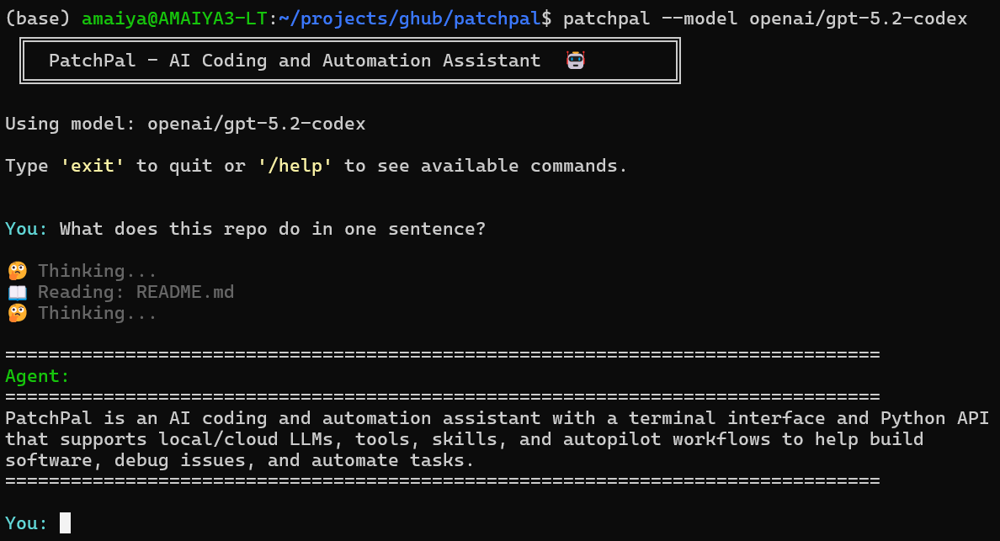

# PatchPal — An Agentic Coding and Automation Assistant

<!---->


> Supporting both local and cloud LLMs, with autopilot mode and extensible tools.

**PatchPal** is an AI coding agent that helps you build software, debug issues, and automate tasks. It supports agent skills, tool use, and executable Python generation, enabling interactive workflows for tasks such as data analysis, visualization, web scraping, API interactions, and research with synthesized findings.

In the past, interactive coding agents (e.g., Claude Code, OpenCode, Aider) have been mutually exclusive with programmatic agent frameworks (e.g., smolagents, PydanticAI). A key goal of this project is to marry both: use the same agent in your terminal (`patchpal`) or in Python scripts (`agent.run("task")`), plus autopilot mode for autonomous runs.

**Key Features**
- [Terminal Interface](https://ai.wiseprobe.io/patchpal/usage/interactive/) for interactive development
- [Python API](https://ai.wiseprobe.io/patchpal/usage/python-api/) for flexibility and extensibility
- [Built-In](https://ai.wiseprobe.io/patchpal/features/tools/) and [Custom Tools](https://ai.wiseprobe.io/patchpal/features/custom-tools/)
- [Skills System](https://ai.wiseprobe.io/patchpal/features/skills/)
- [Autopilot Mode](https://ai.wiseprobe.io/patchpal/usage/autopilot/) using [Ralph Wiggum loops](https://ghuntley.com/ralph/)
- [Project Memory](https://ai.wiseprobe.io/patchpal/features/memory/) automatically loads project context from `~/.patchpal/<repo-name>/MEMORY.md` at startup.

PatchPal prioritizes customizability: custom tools, custom skills, a flexible Python API, and support for any tool-calling LLM.

Full documentation is [here](https://ai.wiseprobe.io/patchpal).

## Quick Start

```bash
$ pip install patchpal  # install
$ patchpal              # start
```

## Setup
0. **Install**: `pip install patchpal`
1. **Get an API key or a Local LLM Engine**:
   - **[Cloud]** For Anthropic models (default): Sign up at https://console.anthropic.com/
   - **[Cloud]** For OpenAI models: Get a key from https://platform.openai.com/
   - **[Local]** For vLLM: Install from https://docs.vllm.ai/ (free - no API charges) **Recommended for Local Use**
   - **[Local]** For Ollama: Install from https://ollama.com/ (⚠️ requires `OLLAMA_CONTEXT_LENGTH=32768` - see Ollama section below)
   - For other providers: Check the [LiteLLM documentation](https://docs.litellm.ai/docs/providers)

2. **Set up your API key as environment variable**:
```bash

# For Anthropic (default)
export ANTHROPIC_API_KEY=your_api_key_here

# For OpenAI
export OPENAI_API_KEY=your_api_key_here

# For vLLM - API key required only if configured
export HOSTED_VLLM_API_BASE=http://localhost:8000 # depends on your vLLM setup
export HOSTED_VLLM_API_KEY=token-abc123           # optional depending on your vLLM setup

# For Ollama, no API key required

# For other providers, check LiteLLM docs
```

3. **Run PatchPal**:
```bash
# Use default model (anthropic/claude-sonnet-4-5)
patchpal

# Use a specific model via command-line argument
patchpal --model openai/gpt-5.2-codex  # or openai/gpt-5-mini, anthropic/claude-opus-4-5, etc.

# Use vLLM (local)
# Note: vLLM server must be started with --tool-call-parser and --enable-auto-tool-choice
# See "Using Local Models (vLLM & Ollama)" section below for details
export HOSTED_VLLM_API_BASE=http://localhost:8000
export HOSTED_VLLM_API_KEY=token-abc123
patchpal --model hosted_vllm/openai/gpt-oss-20b

# Use Ollama (local - requires OLLAMA_CONTEXT_LENGTH=32768)
export OLLAMA_CONTEXT_LENGTH=32768
patchpal --model ollama_chat/gpt-oss:20b

# Or set the model via environment variable
export PATCHPAL_MODEL=openai/gpt-5.2
patchpal
```

## Beyond Coding: General Problem-Solving

While originally designed for software development, PatchPal is also a general-purpose assistant. With web search, file operations, shell commands, and custom tools/skills, it can help with research, data analysis, document processing, log file analyses, etc.


## Documentation

Full documentation is [available here](https://ai.wiseprobe.io/patchpal/).
